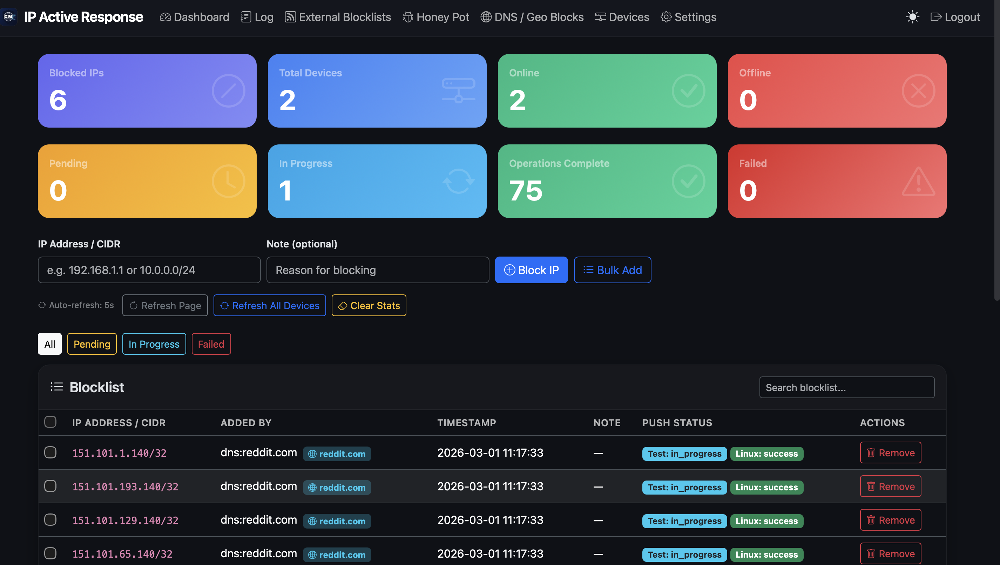
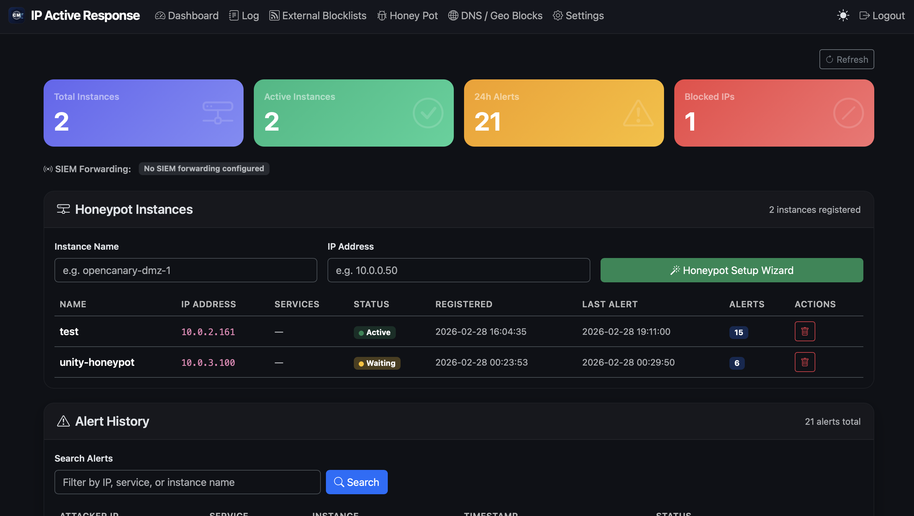
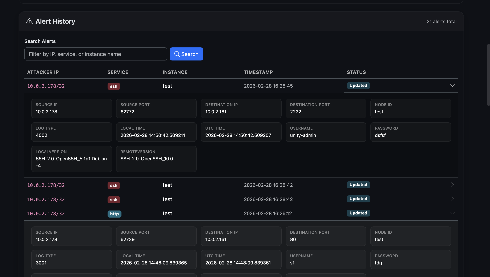
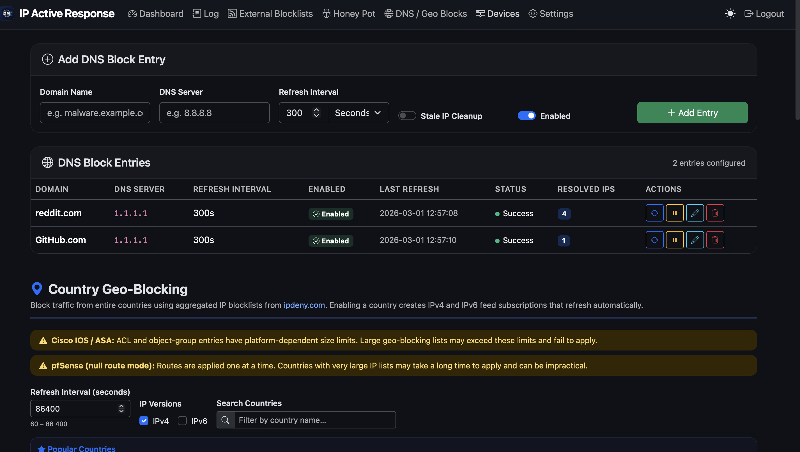
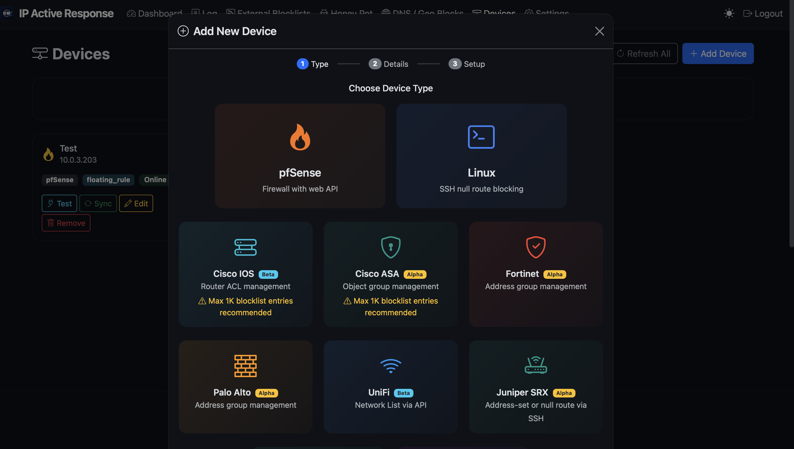

<p align="center">
  
</p>

<h1 align="center">IP Active Response</h1>
<p align="center"><strong>Part of the Cyber Membrane Suite</strong></p>
<p align="center">
  Rapid-response IP blocking for SOC teams. Push blocks across your entire network in seconds, deploy honeypots that automatically block attackers, and enforce geo-level IP restrictions — all from one interface.
</p>

---

## Screenshots

| Dashboard | Honeypot Dashboard |
|:-:|:-:|
|  |  |

| Honeypot Findings | DNS & Geo Blocking |
|:-:|:-:|
|  |  |

<p align="center">
  
</p>

---

## Key Features

- **Instant Network-Wide IP Blocking** — Push IP blocks to every managed device simultaneously using concurrent execution
- **Honeypot Integration (OpenCanary)** — Deploy honeypots that report back and automatically block attackers across the entire network
- **Geo-Blocking** — Block traffic from entire countries using aggregated IP blocklists from ipdeny.com
- **External Threat Feeds** — Subscribe to community blocklists (Spamhaus DROP, Feodo Tracker, etc.) with automatic refresh
- **DNS-Based Blocking** — Resolve malicious domains and block resolved IPs on devices that don't support native DNS filtering
- **SIEM Forwarding** — Forward honeypot alerts to Elasticsearch or Syslog
- **Reconciliation Engine** — Automatically detects and fixes drift between the blocklist and device state
- **Operation Queue** — Reliable background processing with retry logic for all device operations
- **Audit Logging** — Full audit trail of all blocking actions, feed updates, and configuration changes

## Supported Devices

| Device | Status |
|---|---|
| pfSense | Supported |
| Cisco IOS | Supported |
| Cisco ASA | Alpha |
| Linux (SSH) | Supported |
| Fortinet FortiGate | Alpha |
| Palo Alto Networks | Alpha |
| Juniper SRX | Alpha |
| Juniper MX | Alpha |
| Check Point | Alpha |
| Ubiquiti UniFi | Beta |
| AWS WAF | Beta |
| Azure NSG | Alpha |
| GCP Firewall | Alpha |
| OCI NSG | Alpha |

## Quick Start (Docker)

```bash
# Clone the repository
git clone https://github.com/cs64-net/IP-Active-Response && cd ip-active-response

# Generate a secret key
export SECRET_KEY=$(python3 -c "import secrets; print(secrets.token_hex(32))")

# Start
docker compose up -d

# Access the dashboard
open http://localhost:8000
```

Default credentials: `admin` / `admin` — you'll be prompted to change the password on first login.

## Manual Setup

```bash
pip install -r requirements.txt
python app.py
```

Runs on `http://localhost:5000` with debug mode.

## Configuration

| Variable | Default | Description |
|---|---|---|
| `SECRET_KEY` | `change-me-in-production` | Flask session secret |
| `DATABASE_PATH` | `/data/soc_ip_blocker.db` | SQLite database path |

---

<p align="center"><strong>Lab Edition</strong> — Not for commercial use.<br>
